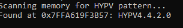

Copy code from [main.cpp](main.cpp) into a console app base in visual studio 2022 then compile.

# HYPV Version Finder

A lightweight memory scanner that automatically finds and extracts the HYPV version from RobloxPlayerBeta.exe while it's running. The tool works by scanning through all readable memory regions of the Roblox process, including read-only, read-write, and executable sections, to locate the HYPV signature and its associated version string.

Unlike traditional reverse engineering approaches that require loading the binary into tools like IDA or Binary Ninja, this tool performs real-time memory analysis to instantly retrieve the HYPV version. Simply start Roblox, run `hypv-finder.exe`, and get immediate results showing both the memory address and full version string - no reverse engineering knowledge or manual analysis required.

## LATEST VERSION

